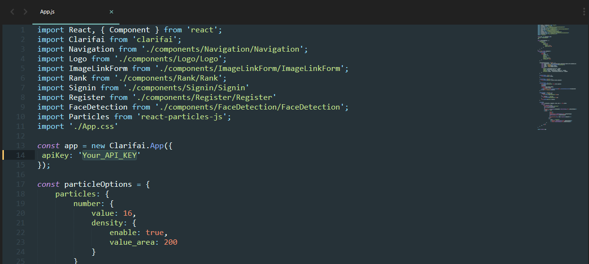

# Face-Detection :blush:

This is a Web-App made in React which can detect faces.
1. Clone this repo
2. You must add your own API key in the `src/App.js` file to connect to Clarifai.

3. Run `cd/Face-Detection`
4. Run `npm install` or `npm i`
5. Run `npm start`

You can grab your Clarifai API key :key: [here](https://www.clarifai.com/)

# Preview :tv:

# Requirments :pencil:

1. Download node.js from [here](https://nodejs.org/en/download/)
